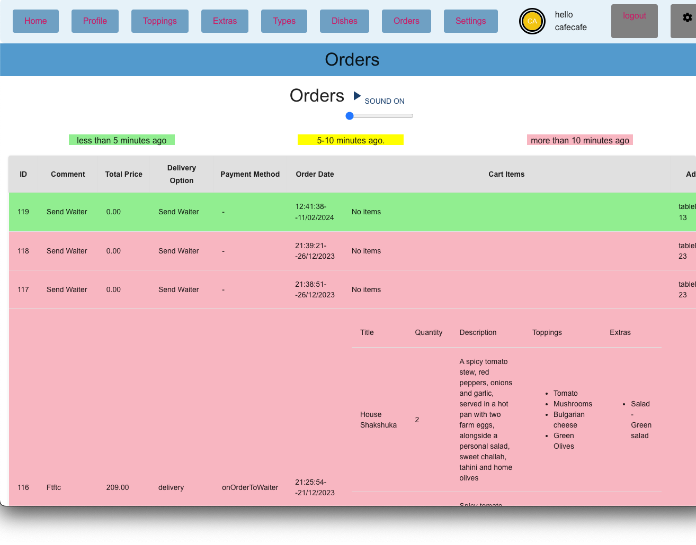
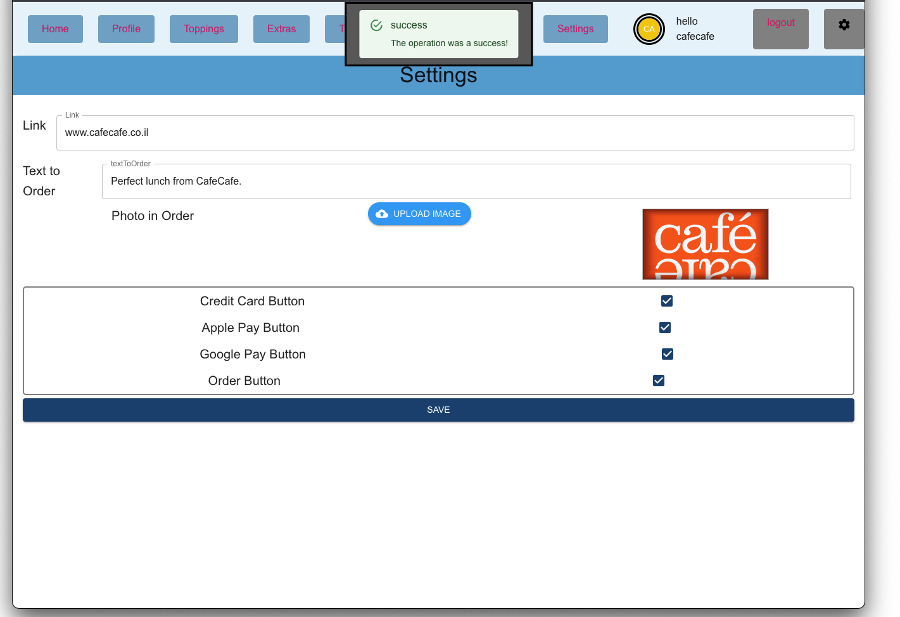

# Burger Bot Dashboard React

## Description

This project is a React application for a Burger Bot dashboard. Application is intended for managing orders, dishes, extras, toppings, and user profiles.

## Features

### Order Management:
- Viewing and managing customer orders
- Tracking order statuses and processing them

### Dish Management:
- Adding, editing, and removing dishes from the menu
- Uploading photos and descriptions
- Setting prices and categories

### Extras and Toppings Management:
- Similar functionality to dish management

### User Management:
- User profiles and login/logout functionality
- Order history or preferences (optional)

### Statistics:
- Analyzing sales data and trends
- Tracking user behavior and preferences

## Technical Features

- Frontend: React
- Backend: API or database 
- Additional files: styles, configuration
- Repository: [GitHub Repository](https://github.com/yair-roshal/000-burger-bot-dashboard-react)

## Note

This project is under development, and more features may be added in the future.

## Screenshots

- auth
  

 <br>
 
- profile
  

 <br>
 
- toppings
  

 <br> 
 
- extras
  

 <br> 
 
- types
  

 <br> 
 
- dishes
  

 <br> 
 
- orders
  

 <br> 
 
- settings
  

 <br>
 
## Getting Started

1. Clone the project:
```bash
   git clone https://github.com/yair-roshal/000-burger-bot-dashboard-react.git
```

2. Install dependencies:
```bash
npm install
   ```

3. Start the server:
```bash
npm start
   ```

Open a browser and navigate to http://localhost:3000.


## checking deploy ->

### `master`

[](https://app.netlify.com/sites/burger-dashboard-orders/deploys)

##

### `dev`

[](https://app.netlify.com/sites/burger-dashboard-orders/deploys)
